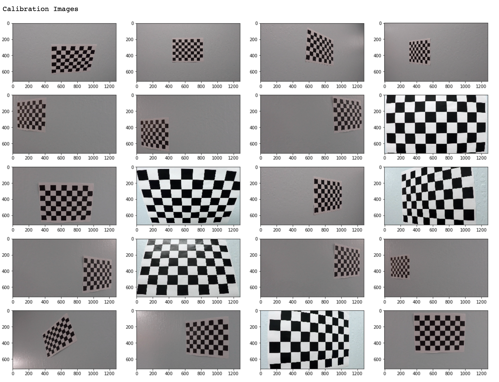
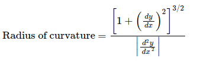

## Overview
The steps of this project are the following:
* Compute the camera calibration matrix and distortion coefficients with a set of chessboard images.
* Apply a distortion correction to raw images.
* Use color transforms, gradients, etc., to create a thresholded binary image.
* Apply a perspective transform to rectify binary image ("birds-eye view").
* Detect lane pixels and fit to find the lane boundary.
* Determine the curvature of the lane and vehicle position with respect to center.
* Warp the detected lane boundaries back onto the original image.
* Output visual display of the lane boundaries and nuemerical estimation of lane curvature and vehicle position.

#### Tech Stack
* Python
* NumPy
* Scipy
* OpenCV

### Camera calibration using chessboard images
A set of chessboard images photographed at different angles were used for this purpose. 

<p align="center">
  
</p>

There are two types of distortion in this set of calibration images.

| Tangential    | Radial           |
|:-------------:|:-------------:|
|      | |
|      |       |

So for each image path:
* image is converted to grayscale using `cv2.cvtColor`
* chessboard corners are found using `cv2.findChessboardCorners`

Once the chessboard corners are found, `cv2.calibrateCamera` is called to obtain the calibration value that will be used to undistort our video images. 

### Distortion correction

Using `cv2.undistort`, the chessboard images can be undistorted.

| Original    | Corrected           |
|:-------------:|:-------------:|
|      | |

### Thresholded binary image

Filters used:
* Gradient on x and y axis with sobel filter size of 5
* HSV for yellow lane lines
* RGB for white lane lines
* S channel with a mask to suppress shadow

These thresholds are combined using logical `OR`.

| Original    | Thresholded           |
|:-------------:|:-------------:|
|      | |

### Perspective transform

From an image frame, coordinates are selected in a shape of a trapezoid. The destination coordinates, in a shape of rectangle, are selected. Using `cv2.getPerspectiveTransform`, perspective transform *M* and inverse perspective transform *Minv* are calculated, which then will be used for image transformation.

```python
def transform_image(img,size,src,dst):
    M = cv2.getPerspectiveTransform(src,dst)
    Minv = cv2.getPerspectiveTransform(dst,src)
    warped_image = cv2.warpPerspective(img,M,size,flags=cv2.INTER_LINEAR)
    return warped_image, M, Minv
```

| Original    | Transformed           |
|:-------------:|:-------------:|
|      | |

### Finding lane lines

Using scipy.signal's `find_peaks_cwt()` lane line pixels are calculated. Then using sliding window search, found peaks are then connected to form lines. 

| Sliding Window Search    | Peaks Connected            |
|:-------------:|:-------------:|
|      | |

### Finding curvature and vehicle position

<p align="center">
  
</p>


## See it in Action

<p align="center">
    <iframe width="600" height="400" src="https://www.youtube.com/embed/ng9edgddoms" frameborder="0" allow="accelerometer; autoplay; encrypted-media; gyroscope; picture-in-picture" allowfullscreen></iframe>
</p>