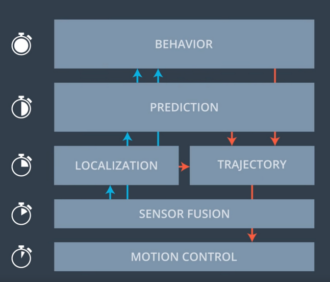

  

## Overview
* Build a path planner that creates smooth, safe trajectories for the car to follow.
* The simulated highway environment (provided by **Udacity**) has other vehicles, all going different speeds, but approximately obeying the 50 (+- 10) MPH speed limit.
* The subject vehicle transmits its location, along with its sensor fusion data, which estimates the location of all the vehicles on the same side of the road.
* The subject vehicle moves from point to point perfectly, so no controller building is needed. 

### Path planning layers

  

Path planning of an autonomous vehicle is an ensemble of different functional layers.
* **Behaviour** - With the input of previous layers, this layer decides the future state of the subject.
* **Prediction** - This layer identifies entities in a given situation and predicts future changes given sensor perception data.
* **Localization** - It is the layer responsible for understanding the subject's and other entities' current locations.
* **Trajectory** - It calculates the motion flow through space as a function of time.
* **Sensor Fusion** - This layer gathers all the different sensor data helps other layers to make sense of the world.
* **Motion Control** - It's job is to move and control the vehicle.

### The simulator and the sensor fusion data

The provided `Udacity` simulator with the `data/highway_map.csv`, creates waypoints that go all the way around the track. The entire track is composed of 181 way points in a loop. 

The waypoints are located in the center of the double-yellow driving line in the center of the highway.

 Each waypoint has (x,y) global map position, normal vector in x and y components, and Frenet s and d values (explained below). 
 
 The highway has 6 lanes total, 3 on each side of the double-yellow driving line, with each lane being 4 m wide. 

### Trajectory

When describing location of a subject on a plane, cartesian coordiate system is often used to represent the location with x and y. 