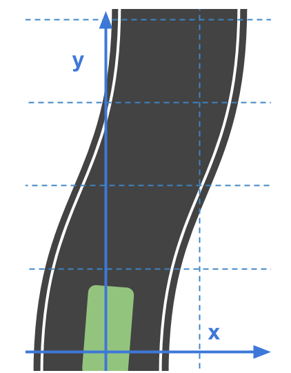
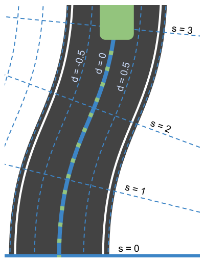
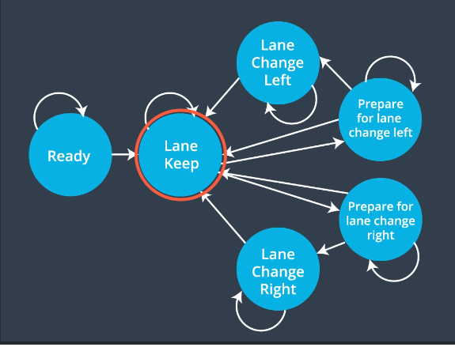

<p align="center">
  
</p>

## Overview
* Build a path planner that creates smooth, safe trajectories for the car to follow.
* The simulated highway environment (provided by **Udacity**) has other vehicles, all going different speeds, but approximately obeying the 50 (+- 10) MPH speed limit.
* The subject vehicle transmits its location, along with its sensor fusion data, which estimates the location of all the vehicles on the same side of the road.
* The subject vehicle moves from point to point perfectly, so no controller building is needed. 

### Path planning layers

<p align="center">
  
</p>

Path planning of an autonomous vehicle is an ensemble of different functional layers.
* **Behaviour** - With the input of previous layers, this layer decides the future state of the subject.
* **Prediction** - This layer identifies entities in a given situation and predicts future changes given sensor perception data.
* **Localization** - It is the layer responsible for understanding the subject's and other entities' current locations.
* **Trajectory** - It calculates the motion flow through space as a function of time.
* **Sensor Fusion** - This layer gathers all the different sensor data helps other layers to make sense of the world.
* **Motion Control** - It's job is to move and control the vehicle.

### The simulator and the sensor fusion data

The provided `Udacity` simulator with the `data/highway_map.csv`, creates waypoints that go all the way around the track. The entire track is composed of 181 way points in a loop. 

The waypoints are located in the center of the double-yellow driving line in the center of the highway.

 Each waypoint has (x,y) global map position, normal vector in x and y components, and Frenet s and d values (explained below). 
 
 The highway has 6 lanes total, 3 on each side of the double-yellow driving line, with each lane being 4 m wide. 

### Trajectory

When describing location of a subject on a plane, cartesian coordinate system is often used to represent the location with x and y. 

In the real world, roads are not always straight and identifying locations of vehicles on curvy roads can be very challenging when using cartesian coordinates.

<p align="center">
  
</p>


With the help frenet coordinate system, the relative position of a subject can be described in terms of longitudinal displacement `S` and lateral displacement `D` along the road, in this case, the double-yellow driving line. Imagin a line that goes along the middle of the road, it which would be S, and how far the subject is from S, which would be D. 

|     |       |
|:-------------:|:-------------:|
| Cartesian   | Frenet|

```cpp
// Transform from Cartesian x,y coordinates to Frenet s,d coordinates
vector<double> getFrenet(double x, double y, double theta, 
                         const vector<double> &maps_x, 
                         const vector<double> &maps_y) 
{
  int next_wp = NextWaypoint(x,y, theta, maps_x,maps_y);
  int prev_wp;
  prev_wp = next_wp-1;
  if (next_wp == 0) {
    prev_wp  = maps_x.size()-1;
  }
  double n_x = maps_x[next_wp]-maps_x[prev_wp];
  double n_y = maps_y[next_wp]-maps_y[prev_wp];
  double x_x = x - maps_x[prev_wp];
  double x_y = y - maps_y[prev_wp];
  // find the projection of x onto n
  double proj_norm = (x_x*n_x+x_y*n_y)/(n_x*n_x+n_y*n_y);
  double proj_x = proj_norm*n_x;
  double proj_y = proj_norm*n_y;
  double frenet_d = distance(x_x,x_y,proj_x,proj_y);
  //see if d value is positive or negative by comparing it to a center point
  double center_x = 1000-maps_x[prev_wp];
  double center_y = 2000-maps_y[prev_wp];
  double centerToPos = distance(center_x,center_y,x_x,x_y);
  double centerToRef = distance(center_x,center_y,proj_x,proj_y);
  if (centerToPos <= centerToRef) {
    frenet_d *= -1;
  }
  // calculate s value
  double frenet_s = 0;
  for (int i = 0; i < prev_wp; ++i) {
    frenet_s += distance(maps_x[i],maps_y[i],maps_x[i+1],maps_y[i+1]);
  }
  frenet_s += distance(0,0,proj_x,proj_y);
  return {frenet_s,frenet_d};
}
```

If we were to represent the original road image in cartesian coordinate system with frenet coordinate system, it would be as follows:

<p align="center">
  
</p>

```cpp
// Transform from Frenet s,d coordinates to Cartesian x,y
vector<double> getXY(double s, double d, const vector<double> &maps_s, 
                     const vector<double> &maps_x, 
                     const vector<double> &maps_y) {
  int prev_wp = -1;

  while (s > maps_s[prev_wp+1] && (prev_wp < (int)(maps_s.size()-1))) {
    ++prev_wp;
  }
  int wp2 = (prev_wp+1)%maps_x.size();
  double heading = atan2((maps_y[wp2]-maps_y[prev_wp]),
                         (maps_x[wp2]-maps_x[prev_wp]));
  // the x,y,s along the segment
  double seg_s = (s-maps_s[prev_wp]);
  double seg_x = maps_x[prev_wp]+seg_s*cos(heading);
  double seg_y = maps_y[prev_wp]+seg_s*sin(heading);
  double perp_heading = heading-pi()/2;
  double x = seg_x + d*cos(perp_heading);
  double y = seg_y + d*sin(perp_heading);
  return {x,y};
}
```

### State machine 
The state machine used for this purpose is as follows:

<p align="center">
  
</p>

The vehicle will mostly stay in the **Keep Lane** state but will transition to **Prepare for Lane Change Left/Right** states before actually moving to **Lane Change Left/Right** states and change lanes. These transitional states ensure safe lane changes. 

To implement this state machine, the vehicle first checks if the lane changes are possible by looking to see if there is enough space front and back of the vehicle in the intended lane with **checkToChangeLane()** as shown below:

```cpp
bool checkToChangeLane(const int p_value, const double vehicle_s, const double check_lane, const vector<vector<double>> & sensor_fusion_data)
{
  bool do_change_lane = false;
  double buffer_front = 100000;
  double buffer_rear  = -100000;

  for(int i = 0; i < sensor_fusion_data.size(); i++){
    float d = sensor_fusion_data[i][6];
    double detected_vehicles = findVehicleLane(d);

    if(detected_vehicles == check_lane){
      double vx = sensor_fusion_data[i][3];
      double vy = sensor_fusion_data[i][4];
      double vehicle_speed = sqrt(vx*vx + vy*vy);
      double vehicle_s_check = sensor_fusion_data[i][5];

      vehicle_s_check += ((double)p_value * 0.02 * vehicle_speed);

      double dist_s = vehicle_s_check - vehicle_s;
      double dist_pos = sqrt(dist_s * dist_s);  

      if(dist_s > 0){ 
        buffer_front = min(dist_s, buffer_front);
      }
      else if(dist_s <= 0){
        buffer_rear = max(dist_s, buffer_rear);
      }
    }
  } 

  if((buffer_front > 20) && (-1 * buffer_rear > 13)) 
  {
    do_change_lane = true;
  }
  return do_change_lane;
}
```

 